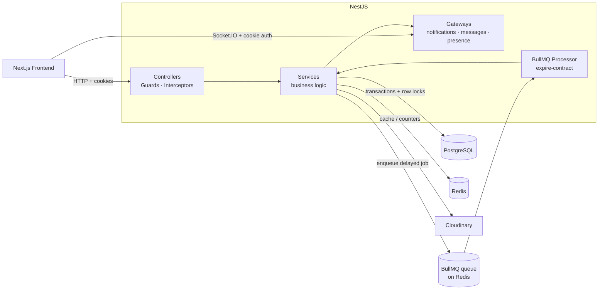
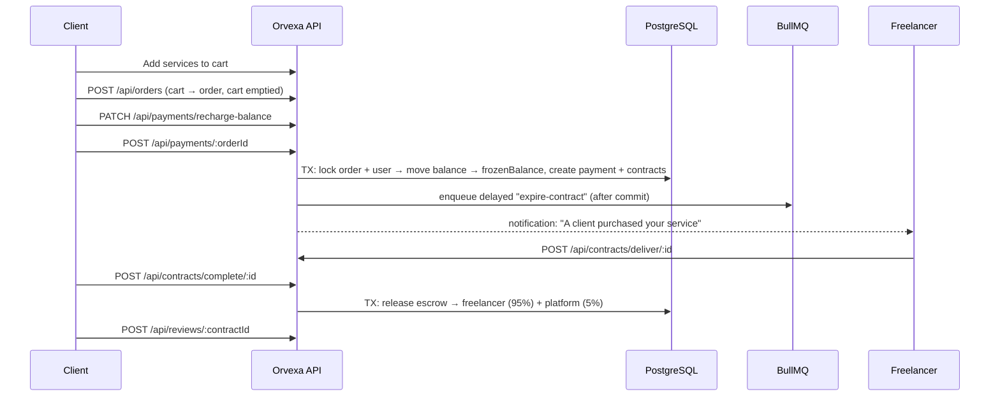
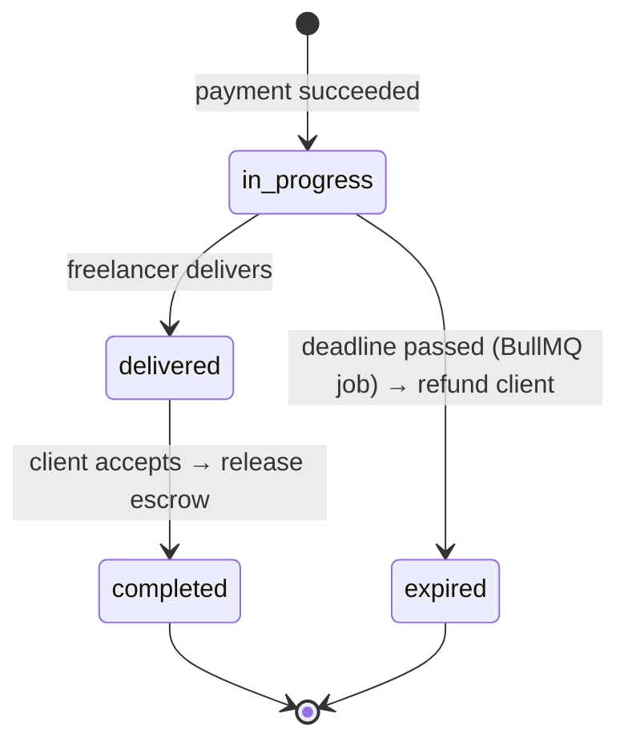

# Orvexa Backend — Orvexa Digital Services Marketplace API

REST + WebSocket API for **Orvexa**, a freelance services marketplace where clients buy services from freelancers, pay through an **escrow-style balance system**, and work together inside a **contract** until the delivery is accepted.

Built with **NestJS 12**, **PostgreSQL (Sequelize)**, **Redis**, **BullMQ** and **Socket.IO**.

> The interesting part of this project is not the CRUD — it is how money and contract state are kept **consistent under concurrency and failure**. See [Engineering Challenges & Solutions](#engineering-challenges--solutions).

---

## Table of Contents

- [Tech Stack](#tech-stack)
- [Architecture Overview](#architecture-overview)
- [Project Structure](#project-structure)
- [Domain Model](#domain-model)
- [Business Flow](#business-flow)
- [Contract Lifecycle](#contract-lifecycle)
- [Engineering Challenges & Solutions](#engineering-challenges--solutions)
  - [1. Race condition in payment](#1-race-condition-in-payment)
  - [2. Automatic contract expiration with BullMQ](#2-automatic-contract-expiration-with-bullmq)
  - [3. Safe contract completion & commission split](#3-safe-contract-completion--commission-split)
  - [4. Side effects only after commit](#4-side-effects-only-after-commit)
  - [5. Price & delivery-time snapshots](#5-price--delivery-time-snapshots)
  - [6. Brute-force login protection with Redis](#6-brute-force-login-protection-with-redis)
  - [7. Redis caching](#7-redis-caching)
  - [8. Real-time layer](#8-real-time-layer)
- [Authentication & Authorization](#authentication--authorization)
- [API Reference](#api-reference)
- [Getting Started](#getting-started)
- [Environment Variables](#environment-variables)
- [Database Seeding](#database-seeding)
- [Testing](#testing)
- [Known Limitations & Roadmap](#known-limitations--roadmap)

---

## Tech Stack

| Layer            | Technology                                              |
| ---------------- | ------------------------------------------------------- |
| Framework        | NestJS 12 (TypeScript, ESM)                             |
| Database         | PostgreSQL via Sequelize + `sequelize-typescript`       |
| Cache / counters | Redis (`ioredis`)                                       |
| Background jobs  | BullMQ (`@nestjs/bullmq`)                               |
| Real-time        | Socket.IO (`@nestjs/websockets`, custom auth adapter)   |
| Auth             | JWT (access + refresh) in HTTP-only cookies, `bcryptjs` |
| File storage     | Cloudinary (`multer` + `streamifier`)                   |
| Validation       | `class-validator` / `class-transformer`                 |
| API docs         | Swagger (`@nestjs/swagger`)                             |
| Testing          | Vitest                                                  |
| Tooling          | oxlint, Prettier, `tsx`                                 |

---

## Architecture Overview



The codebase is organized as **feature modules** (controller → service → Sequelize schema) plus a shared `infrastructure` layer (Redis, BullMQ, Cloudinary, token service, gateways) and a `common` layer (guards, enums, interceptors, message constants).

All successful HTTP responses are wrapped by a global `ResponseInterceptor`:

```json
{ "success": true, "message": "…", "data": {} }
```

---

## Project Structure

```
backend/
├── src/
│   ├── main.ts                      # bootstrap: cookies, CORS, ValidationPipe, socket adapter, Swagger
│   ├── app.module.ts
│   ├── seed.ts                      # database seeder entry point
│   ├── common/
│   │   ├── decorators/              # @Roles()
│   │   ├── enums/                   # contract, order, payment, service, user, …
│   │   ├── guards/                  # Auth, Roles, UserActive, UserVerification
│   │   ├── interceptors/            # ResponseInterceptor
│   │   └── libs/                    # response helper, messages, assertOwnerOrAdmin, sanitizeUser
│   ├── infrastructure/
│   │   ├── adapters/                # AuthSocketAdapter (cookie JWT auth for Socket.IO)
│   │   ├── cloudinary/
│   │   ├── database/
│   │   │   ├── bullmq/              # queue connection + default job options
│   │   │   ├── redis/               # RedisService + RedisHelper
│   │   │   └── seeders/             # users, services, orders, contracts, …
│   │   ├── gateways/                # notification, notification-socket, message, presence
│   │   └── token/                   # JWT sign / verify
│   └── modules/
│       ├── auth/
│       ├── users/
│       ├── profiles/                # user-profiles + freelancer
│       ├── user-verifications/
│       ├── services/
│       ├── carts/
│       ├── orders/
│       ├── payments/
│       ├── contracts/               # service + BullMQ processor
│       ├── messages/                # contract chat
│       ├── reviews/
│       ├── notifications/
│       ├── platform-wallets/
│       └── supports/                # conversations + messages
└── test/
```

---

## Domain Model

| Entity                                   | Purpose                                                                                                                            |
| ---------------------------------------- | ---------------------------------------------------------------------------------------------------------------------------------- |
| **User**                                 | Account with `role` (`admin`, `support`, `freelancer`, `client`), `balance`, `frozenBalance`, `isActive`.                          |
| **UserProfile**                          | Avatar, cover, bio (Cloudinary images).                                                                                            |
| **Freelancer**                           | Freelancer profile: job title, about, skills, website, `completedOrders`, `ratingAverage`, `ratingCount`.                          |
| **UserVerification**                     | Identity verification request (profile image + ID document) with `pending / approved / rejected`.                                  |
| **Service**                              | A gig: category, title, description, features, keywords, images, `price`, `deliveryDays`, status `pending / published / rejected`. |
| **Cart / CartItem**                      | Client's shopping cart.                                                                                                            |
| **Order**                                | Snapshot of the purchased services (JSONB) + `totalAmount` + status.                                                               |
| **Payment**                              | Record of a completed payment for an order.                                                                                        |
| **Contract**                             | One contract **per service** inside an order: amount, `deadline`, status, delivery/completion timestamps.                          |
| **Message**                              | Chat message (text + up to 5 images) inside a contract.                                                                            |
| **Review**                               | Rating + comment, one per completed contract.                                                                                      |
| **Notification**                         | In-app notification, delivered live over WebSocket.                                                                                |
| **PlatformWallet**                       | Accumulates the platform's commission.                                                                                             |
| **SupportConversation / SupportMessage** | Support tickets between users and support/admin staff.                                                                             |

Monetary values use `DECIMAL(12, 2)`.

---

## Business Flow



1. **Cart → Order** — the cart is turned into an order with a snapshot of each service (title, price, delivery days, freelancer info) and the cart is emptied, all in one transaction.
2. **Payment (escrow)** — the order total moves from the client's `balance` to `frozenBalance`. The money is _held_, not yet paid to the freelancer.
3. **Contracts** — one contract per purchased service is created with a deadline = `now + deliveryDays`.
4. **Work & chat** — client and freelancer chat in real time inside the contract while it is `in_progress`.
5. **Delivery** — the freelancer marks the contract as delivered.
6. **Completion** — the client accepts; the frozen amount is released: **95% to the freelancer, 5% platform commission**.
7. **Review** — the client can rate the service once the contract is completed.
8. **If the freelancer misses the deadline** — a BullMQ job automatically **expires the contract and refunds the client**.

---

## Contract Lifecycle



| Status        | Meaning                                          | Who/what moves it here                     | Money effect                                            |
| ------------- | ------------------------------------------------ | ------------------------------------------ | ------------------------------------------------------- |
| `in_progress` | Work started, chat enabled, expiry job scheduled | Successful payment                         | `balance → frozenBalance`                               |
| `delivered`   | Freelancer says the work is ready                | Freelancer (`POST /contracts/deliver/:id`) | none                                                    |
| `completed`   | Client accepted the delivery                     | Client (`POST /contracts/complete/:id`)    | frozen amount → freelancer (95%) + platform wallet (5%) |
| `expired`     | Deadline passed without delivery                 | BullMQ worker                              | `frozenBalance → balance` (full refund)                 |

The enum also declares `cancelled`, `disputed` and `refunded` (and the schema has `cancelledAt` / `cancellationReason`) as groundwork for a future dispute/cancellation flow — see [Roadmap](#known-limitations--roadmap).

**Rules enforced by the code**

- Only the **contract's freelancer** can deliver; only the **contract's client** can complete.
- A contract can be delivered **only from `in_progress`**, and completed **only from `delivered`**.
- Chat messages can be sent/deleted by participants **only while the contract is `in_progress`** (admins can still moderate).
- A review is allowed **only for `completed` contracts**, **once per contract**, and only if a completed payment exists for the order.

---

## Engineering Challenges & Solutions

### 1. Race condition in payment

**The problem.** Payment touches several shared rows (order, user balance, payments, contracts). Without protection, concurrent requests can corrupt money state:

| Scenario                                                                         | What would go wrong                                                                                               |
| -------------------------------------------------------------------------------- | ----------------------------------------------------------------------------------------------------------------- |
| Client double-clicks **Pay** (two identical requests)                            | Both pass the "order is pending" check → the client is charged **twice** and **duplicate contracts** are created. |
| Client pays **two different orders at once** with a balance that only covers one | Both read the same balance → balance goes **negative** / money is spent that does not exist.                      |
| Request crashes halfway                                                          | Balance deducted but no contract created (or the reverse).                                                        |

**The solution** (`PaymentService.pay`). Everything runs in **one database transaction** that takes **pessimistic row locks** (`SELECT … FOR UPDATE`) in a fixed order:

```ts
const transaction = await this.sequelize.transaction();

// 1. Lock the order (only the owner can pay it)
const order = await this.orderModel.findOne({
  where: { id: orderId, clientId: userId },
  transaction,
  lock: transaction.LOCK.UPDATE,
});

// 2. Re-check the status AFTER acquiring the lock
if (order.status !== OrderStatus.PENDING_PAYMENT) throw new BadRequestException(…);

// 3. Lock the user's balance row
const user = await this.userModel.findByPk(userId, { transaction, lock: transaction.LOCK.UPDATE });

// 4. Check balance → 5. make sure no completed payment already exists (also locked)
// 6. balance -= amount ; frozenBalance += amount
// 7. create Payment → 8. create one Contract per service → 9. order.status = IN_PROGRESS
await transaction.commit();
```

Why this works:

- **Order lock** — the second concurrent request _blocks_ until the first one commits. When it resumes, the order is already `in_progress`, so the status check fails and it is rejected. **No double charge, no duplicate contracts.**
- **User-row lock** — two payments for different orders are serialized on the same balance row, so the second one sees the _updated_ balance and fails with "insufficient balance" instead of overdrawing.
- **Existing-payment guard** — a defensive second line of defense against paying an order that already has a `COMPLETED` payment.
- **Atomicity** — money movement, payment record, contracts and order status either **all** happen or **none** do (rollback on any error).
- **Consistent lock order** (order → user) to avoid deadlocks.

### 2. Automatic contract expiration with BullMQ

**The problem.** If a freelancer never delivers, the client's money would stay frozen forever. We need something that fires **exactly when each contract's deadline passes**, survives server restarts, and works with multiple server instances. `setTimeout` or a naive cron polling the table would be fragile or wasteful.

**The solution.** A **delayed BullMQ job per contract**, created right after the payment commits:

```ts
await this.contractQueue.add(
  'expire-contract',
  { contractId: contract.id },
  {
    delay: Math.max(0, contract.deadline.getTime() - Date.now()),
    jobId: `expire-contract-${contract.id}`, // idempotent: one job per contract
  },
);
```

- **Persistent** — jobs live in Redis, so they survive restarts and deployments.
- **Idempotent enqueue** — the deterministic `jobId` means the same contract can never get two jobs.
- **Worker** (`ContractProcessor`) — listens on the `contracts` queue with `concurrency: 10` and a rate limiter of 20 jobs/second so a burst of expirations cannot overwhelm PostgreSQL.
- **Retries** — global default job options: 3 attempts with exponential backoff (1s base), completed jobs removed, last 1000 failed jobs kept for inspection.

**The job handler is safe to run late, twice, or concurrently with other actions** (`ContractService.expire`):

```text
BEGIN
  lock contract row (FOR UPDATE)
  if contract.status != in_progress → return "already processed"   // delivered/completed in the meantime
  if contract.deadline > now        → return "not due"             // defensive: deadline never moves earlier
  lock client row (FOR UPDATE)
  client.balance       += amount
  client.frozenBalance -= amount
  contract.status = expired
COMMIT
→ notify client (refunded) and freelancer (contract terminated)
```

Why there is **no need to cancel the job** when the freelancer delivers: the handler re-reads the contract under a lock and simply exits if it is no longer `in_progress`. This removes a whole class of "forgot to remove the job" bugs.

### 3. Safe contract completion & commission split

`ContractService.complete` locks, in a single transaction: **contract → order → service → client → freelancer → freelancer's user → platform wallet**, then:

```text
amount           = contract.amount
commission       = amount * 5%
freelancerAmount = amount - commission

client.frozenBalance      -= amount          (guarded: throws if frozen < amount)
freelancer.user.balance   += freelancerAmount
platformWallet.balance    += commission
freelancer.completedOrders += 1
service.ordersCount        += 1
contract.status = completed ; order.status = completed
```

- The contract lookup includes `clientId = currentUser` **and** a status check under the lock, so a double-click / retry can **never pay the freelancer twice**.
- The platform wallet row is created lazily if it does not exist.
- An **insufficient frozen balance** check protects against inconsistent ledgers.
- Admins can later move the accumulated commission to an admin account with `PlatformWalletService.withdraw`, which also locks both wallet and admin rows.

### 4. Side effects only after commit

Notifications (DB + WebSocket) and BullMQ jobs are **never** executed inside a transaction:

- If they ran _before_ commit, a rollback would leave a **ghost job** or a notification about a payment that never happened.
- A job could even fire **before the contract row becomes visible** to the worker.

`pay()` keeps a `committed` flag so a failure in a post-commit step (e.g. Redis down) does **not** try to roll back an already-committed transaction. This behaviour is covered by unit tests (_"should NOT rollback after commit if a post-commit step fails"_, _"should commit before notifications and queue jobs"_).

### 5. Price & delivery-time snapshots

`Order.services` is a **JSONB snapshot** of each service at purchase time (title, description, price, delivery days, images, freelancer info). Contracts copy `amount` and `deliveryDays` from that snapshot. If a freelancer edits or deletes the service later, **existing orders and contracts are unaffected**, and the client is always charged the price they saw.

### 6. Brute-force login protection with Redis

On every failed login for an email a counter `auth:login:attempts:<email>` is incremented in Redis with a 15-minute TTL. After **5 failed attempts** the account is temporarily blocked from logging in; a successful login clears the counter. Error messages for "unknown email" and "wrong password" are identical to avoid user enumeration.

### 7. Redis caching

Read-heavy endpoints are cached with a 5-minute TTL (`RedisHelper.getJSON/set`):

- `services:list:<page>:<limit>`, `service:<id>` (1 minute for the admin pending list)
- `reviews:service:…`, `reviews:freelancer:…`, `review:<id>`
- `contracts:me:<userId>`, `contracts:one:<userId>:<contractId>`, `contracts:all:…`

Cache keys are scoped per user where the data is private, so one user can never receive another user's cached contracts.

### 8. Real-time layer

- **Socket.IO authentication** — a custom `AuthSocketAdapter` reads the **HTTP-only cookie** from the WebSocket handshake and verifies the JWT, so sockets use exactly the same auth as REST (no token in query strings).
- **Gateways**
  - `NotificationGateway` — pushes `receive-notification`, `notification-read`, `notifications-marked-as-read`.
  - `NotificationSocketGateway` — handles incoming `mark-as-read`.
  - `MessageGateway` — pushes `receive-message` and `message-deleted` for contract chat.
  - `PresenceGateway` — broadcasts `online-users`.
- Multiple tabs/devices per user are supported (a user maps to several socket ids).
- The gateway ↔ service circular dependency is avoided by splitting _outgoing_ events (`NotificationGateway`) from _incoming_ events (`NotificationSocketGateway`).

---

## Authentication & Authorization

- **Register / login** issue two JWTs as **HTTP-only cookies**: `token` (access, 15 min) and `refreshToken` (30 days). The refresh token is stored **hashed** (bcrypt) in the database, so a leaked DB cannot be used to mint sessions.
- `POST /api/auth/refreshToken` verifies the cookie against the stored hash and issues a new access token. The frontend transparently retries a request once after a `401`.
- Passwords are hashed with bcrypt (cost 12). Sensitive fields (`password`, `refreshToken`) are stripped by `sanitizeUser` before any response.

Guards are composed per controller:

| Guard                     | Responsibility                                                                                                            |
| ------------------------- | ------------------------------------------------------------------------------------------------------------------------- |
| `AuthGuard`               | Valid access-token cookie.                                                                                                |
| `UserActiveGuard`         | Re-checks in the DB that the user is not blocked (`isActive`). Blocking takes effect immediately even with a valid token. |
| `RolesGuard` + `@Roles()` | Role-based access (`admin`, `support`, `freelancer`, `client`).                                                           |
| `UserVerificationGuard`   | Requires an **approved identity verification** for sensitive actions (e.g. paying, completing a contract).                |

---

## API Reference

Interactive Swagger docs are available at **`http://localhost:4001/api/docs`** once the server is running. Summary of the main route groups:

| Prefix                                                | Highlights                                                                                                  |
| ----------------------------------------------------- | ----------------------------------------------------------------------------------------------------------- |
| `/api/auth`                                           | `register`, `login`, `logout`, `me`, `refreshToken`                                                         |
| `/api/users`                                          | list / get users; admin: update role, block, delete                                                         |
| `/api/user-profiles`                                  | update avatar, cover, bio (multipart)                                                                       |
| `/api/freelancers`                                    | list / get freelancers; freelancer: update own profile                                                      |
| `/api/user-verifications`                             | submit identity docs, retry after rejection; admin: list pending, approve/reject                            |
| `/api/services`                                       | CRUD (freelancer), images upload (max 5), `me`, by freelancer, admin: `pending`, approve/reject with reason |
| `/api/carts`                                          | `me`, add / remove item, clear (client)                                                                     |
| `/api/orders`                                         | create from cart, `me`, get one, delete while pending payment; admin: list all                              |
| `/api/payments`                                       | `POST /:orderId` pay, `me`, `recharge-balance`; admin: list all                                             |
| `/api/contracts`                                      | `me`, get one, `deliver/:id`, `complete/:id`; admin: list all                                               |
| `/api/messages`                                       | send (text + up to 5 images), list by contract, delete; admin: list all                                     |
| `/api/reviews`                                        | create for a completed contract, by service, by freelancer, `me`                                            |
| `/api/notifications`                                  | `me`, mark one / all as read, delete                                                                        |
| `/api/platform-wallets`                               | admin: balance, withdraw commission                                                                         |
| `/api/support-conversations`, `/api/support-messages` | open tickets, chat with support, attachments, close (admin)                                                 |

Validation uses a global `ValidationPipe` (`whitelist`, `transform`) and returns the **first** validation error as a clean message.

---

## Getting Started

**Prerequisites:** Node.js 20+, PostgreSQL, Redis, a Cloudinary account.

```bash
# 1. install
cd backend
npm install

# 2. configure environment
cp .env.example .env     # then fill in the values

# 3. run (tables are created automatically on start)
npm run start:dev

# 4. (optional) seed demo data
npm run seed
```

| Script                                 | Description                          |
| -------------------------------------- | ------------------------------------ |
| `npm run start:dev`                    | Dev server with watch mode           |
| `npm run build` / `npm run start:prod` | Production build / run               |
| `npm run seed`                         | Populate the database with demo data |
| `npm test`                             | Run unit tests                       |
| `npm run test:cov`                     | Tests with coverage                  |
| `npm run lint` / `npm run format`      | oxlint / Prettier                    |

The API listens on `PORT` (default **4001**). CORS is configured for the frontend origin defined in `src/url.ts` (`http://localhost:3000`).

---

## Environment Variables

```env
DB_HOST=localhost
DB_PORT=5432
DB_USERNAME=postgres
DB_PASSWORD=your_password
DB_NAME=your_database_name

JWT_SECRET=your_secret
JWT_REFRESH_SECRET=your_refresh_secret

CLOUDINARY_CLOUD_NAME=your_cloud_name
CLOUDINARY_API_KEY=your_api_key
CLOUDINARY_API_SECRET=your_api_secret

REDIS_URL=redis://127.0.0.1:6379
PORT=4001
```

> Never commit real credentials. Keep `.env` in `.gitignore` and use different secrets per environment.

---

## Database Seeding

`npm run seed` populates a large demo dataset: users (including one admin), profiles, freelancers, verifications, services, carts, orders, payments, contracts, reviews, notifications, messages, support conversations and the platform wallet.

Demo admin account: `admin@orvexa.com` (all seeded users share the same development password defined in `seeders/users.ts`). **Do not use seed data or this password in production.**

---

## Testing

Unit tests are written with **Vitest**, with every service tested in isolation (models, Redis, queue and notification service mocked). There are roughly **250 test cases** across auth, users, services, carts, orders, payments, contracts, messages, reviews, notifications, verifications, wallets and support.

The most critical flows are covered in detail, for example:

- **Payment** — order not found / already processed, insufficient balance, duplicate payment, unavailable services, money movement, _commit-before-notify-and-enqueue_, _no rollback after commit_, rollback on failure.
- **Contracts** — `expire` (not found, already processed, not due, refund + notifications), `complete` (invalid status, missing entities, insufficient frozen balance, platform wallet creation, **5% commission split**), `deliver`.

```bash
npm test
```

---

## Known Limitations & Roadmap

Being explicit about trade-offs and next steps:

- **Enqueue-after-commit gap** — if Redis is unavailable _exactly_ after the payment commits, the expiry job is not created. A periodic reconciliation job (`status = in_progress AND deadline < now`) would make expiration fully self-healing.
- **Cache invalidation** — cached contracts/reviews/services rely on a 5-minute TTL. Explicit invalidation (`redis.del`) on state changes (deliver / complete / expire / review) would remove short-lived staleness.
- **`deliver` is not locked** — it validates the status but does not take a row lock like `expire`/`complete`; wrapping it in a transaction with `FOR UPDATE` would close the tiny delivery-vs-expiry race window.
- **Balance recharge is simulated** — `recharge-balance` credits the balance directly; a real payment provider (e.g. Stripe webhook with idempotency keys) should replace it.
- **Money arithmetic** — amounts are stored as `DECIMAL(12,2)` but computed with JS numbers; a decimal library (e.g. `decimal.js`) or integer cents would avoid floating-point drift.
- **Disputes & cancellation** — enum values (`cancelled`, `disputed`, `refunded`) and schema fields exist but the flows are not implemented yet.
- **Schema management** — `synchronize: true` is convenient in development; use migrations in production.
- **Deployment config** — cookie flags (`secure`, `sameSite`) and the CORS origin are currently set for localhost and should be driven by environment variables in production.
- **Presence / socket registry** is in-memory per process; use the Socket.IO Redis adapter when scaling to multiple instances.
